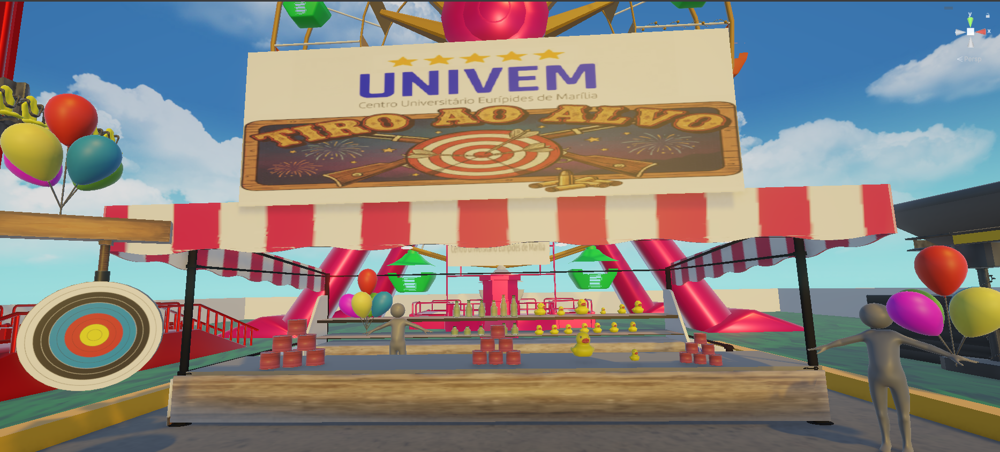
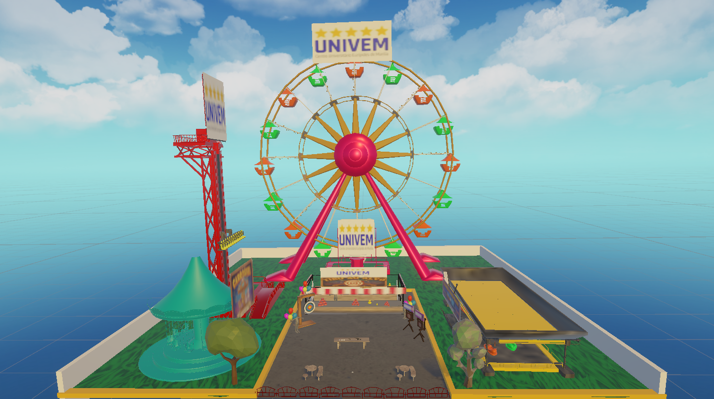
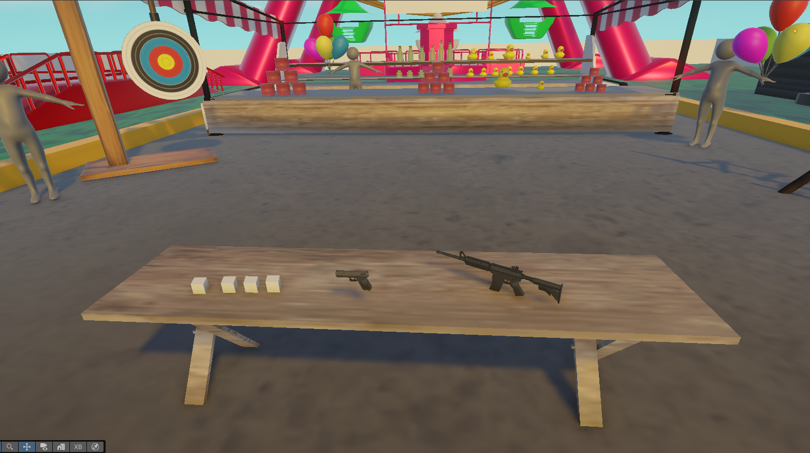
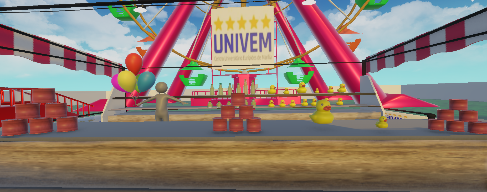
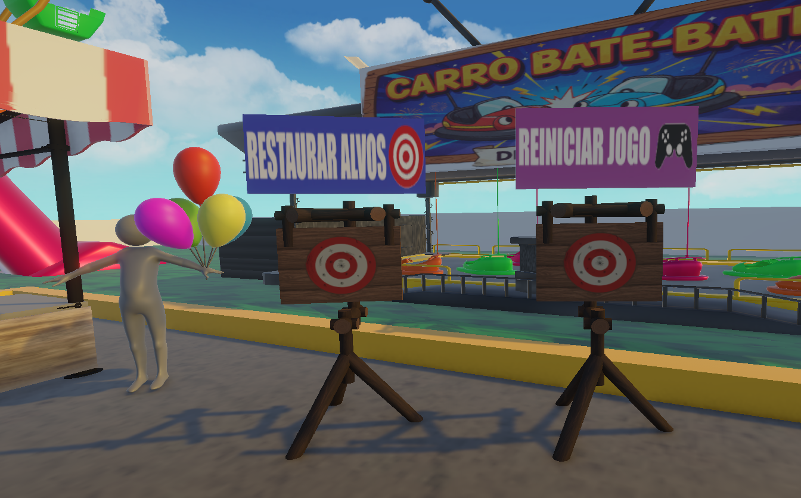

# 🎯 Tiro ao Alvo VR - Meta Quest 3

> Projeto de Realidade Virtual desenvolvido para a disciplina de RV do UNIVEM.
> **Tema:** Parque de Diversões Imersivo.

## 📖 Sobre o Projeto
Este é um simulador de "Tiro ao Alvo" desenvolvido na engine **Unity** utilizando o **XR Interaction Toolkit**. O objetivo do projeto foi criar uma experiência imersiva onde a física realista é o elemento central.

O cenário recria a atmosfera de um parque de diversões, com atrações animadas ao fundo (Roda Gigante, Carrinho Bate-Bate, Carrossel, Elevador) e uma barraca principal onde o jogador deve derrubar latas, garrafas e alvos dinâmicos.

---

## 📸 Galeria do Projeto

| Visão Geral do Mapa | Área de Interação (Armas) |
|:---:|:---:|
|  |  |
| **Cenário completo com atrações animadas** | **Pistola e Rifle com física de colisão** |

| Detalhe dos Alvos | Sistema de Reset Físico |
|:---:|:---:|
|  |  |
| **Latas, Garrafas e Patos (Ragdoll)** | **Botões acionados por tiro (Sem UI 2D)** |

---

## 🚀 Diferenciais Técnicos

### 1. Física de Projéteis Realista (Não é Raycast!)
Para garantir a imersão, abandonamos o sistema de *Raycasting* (laser instantâneo).
- **Implementação:** Os projéteis são instanciados como `Rigidbodies` e recebem uma força vetorial (`linearVelocity`).
- **Resultado:** O jogador precisa considerar o tempo de viagem da bala e a gravidade. O impacto nos alvos transfere energia cinética real (Massa x Velocidade).

### 2. Gerenciamento de Estado Otimizado
O projeto conta com um sistema duplo de reinício para otimizar a performance no hardware mobile do Quest 3:
- **Hard Reset (Reiniciar Jogo):** Recarrega a cena completamente via `SceneManager`.
- **Soft Reset (Restaurar Alvos):** Um `GameManager` armazena as posições iniciais em Listas (`List<Vector3>`). Ao atirar na placa "Restaurar Alvos", o sistema reposiciona apenas os objetos derrubados e zera suas velocidades físicas, sem telas de carregamento.

### 3. Interação VR (XR Toolkit)
- **Mãos Animadas:** Uso do *Input System* para ler valores analógicos (Grip/Trigger), permitindo que a mão virtual feche suavemente acompanhando o movimento real do jogador.
- **Locomoção:** Movimento contínuo via Joystick e Pulo (Botão A).

---

## 🛠️ Tecnologias Utilizadas
* **Engine:** Unity 3D (Versão Recomendada: 2022.3 LTS ou superior)
* **SDK:** Meta XR Interaction Toolkit
* **Linguagem:** C#
* **Hardware Alvo:** Meta Quest 3 / Quest 2

---

## 🎮 Controles

| Ação | Input (Touch Controller) |
| :--- | :--- |
| **Mover-se** | Joystick Esquerdo |
| **Rotacionar** | Joystick Direito (ou movimento da cabeça) |
| **Pular** | Botão A |
| **Pegar Arma** | Botão Grip (Lateral) |
| **Atirar** | Botão Trigger (Gatilho frontal) |
| **Resetar Alvos** | Atirar na placa "Restaurar Alvos" |

---

## 📂 Estrutura de Scripts Principais
* `GameManager.cs`: Gerencia o ciclo de vida dos alvos e reinício otimizado.
* `Pistol.cs` / `Rifle.cs`: Controla a instância do projétil e lógica de disparo.
* `AnimateHandOnInput.cs`: Mapeia os inputs do controle para as animações da mão 3D.
* `ResetButton.cs`: Detecta colisão física para acionar eventos do jogo.

---

## 👥 Autor

* **Leonardo Kenji Funai**

---

## 📝 Licença
Este projeto é de cunho educacional. Sinta-se à vontade para estudar o código.
